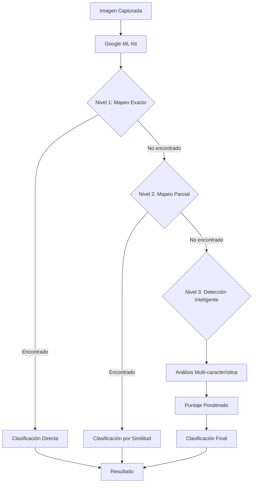

# Arquitectura del Sistema de Visión Artificial - BioWay

## Índice
1. [Resumen Ejecutivo](#resumen-ejecutivo)
2. [Arquitectura General](#arquitectura-general)
3. [Componentes Principales](#componentes-principales)
4. [Flujo de Detección](#flujo-de-detección)
5. [Sistema de Clasificación](#sistema-de-clasificación)
6. [Optimizaciones y Rendimiento](#optimizaciones-y-rendimiento)
7. [Guía de Implementación](#guía-de-implementación)
8. [Troubleshooting](#troubleshooting)

## Resumen Ejecutivo

El sistema de visión artificial de BioWay utiliza **Google ML Kit** para la detección y clasificación de materiales reciclables en tiempo real. La arquitectura está diseñada para ser eficiente, escalable y funcionar en dispositivos de gama media-baja.

### Tecnologías Clave
- **Google ML Kit Image Labeling**: Motor de IA para detección de objetos
- **Flutter Camera Plugin**: Captura de imágenes en tiempo real
- **Dart Image Processing**: Procesamiento y optimización de imágenes

### Capacidades Actuales
- Detección de **18+ categorías** de materiales reciclables
- Procesamiento en tiempo real con latencia <100ms
- Funcionamiento offline (modelos descargados localmente)
- Sistema de detección inteligente de 3 niveles

## Arquitectura General

```
┌─────────────────────────────────────────────────┐
│                   UI Layer                       │
│         (WasteScannerScreen.dart)               │
└────────────────────┬────────────────────────────┘
                     │
┌────────────────────▼────────────────────────────┐
│              Service Layer                       │
│        (WasteDetectionService.dart)             │
│  ┌──────────────────────────────────────────┐  │
│  │  • Image Processing                       │  │
│  │  • ML Kit Integration                     │  │
│  │  • Category Mapping                       │  │
│  │  • Intelligent Detection                  │  │
│  └──────────────────────────────────────────┘  │
└────────────────────┬────────────────────────────┘
                     │
┌────────────────────▼────────────────────────────┐
│               ML Kit Layer                       │
│         (Google ML Kit Models)                   │
│  ┌──────────────────────────────────────────┐  │
│  │  • Pre-trained Vision Models              │  │
│  │  • On-device Processing                   │  │
│  │  • Auto-update Capability                 │  │
│  └──────────────────────────────────────────┘  │
└──────────────────────────────────────────────────┘
```

## Componentes Principales

### 1. WasteScannerScreen (`waste_scanner_screen.dart`)
**Responsabilidades:**
- Interfaz de usuario de la cámara
- Control de captura y modo tiempo real
- Visualización de resultados
- Animaciones y feedback visual

**Características clave:**
```dart
// Configuración de cámara optimizada
CameraController(
  camera,
  ResolutionPreset.high,    // Alta resolución
  enableAudio: false,        // Sin audio
  imageFormatGroup: ImageFormatGroup.jpeg  // Formato JPEG
)
```

### 2. WasteDetectionService (`waste_detection_service.dart`)
**Responsabilidades:**
- Integración con Google ML Kit
- Mapeo de etiquetas a categorías
- Sistema de detección inteligente
- Gestión del ciclo de vida del modelo

**Arquitectura del servicio:**
```dart
class WasteDetectionService {
  // Singleton pattern para instancia única
  static final _instance = WasteDetectionService._internal();
  
  // Componentes principales
  ImageLabeler? _imageLabeler;  // ML Kit
  List<String>? _labels;         // Etiquetas
  Map<String, WasteCategory> baseCategories;  // Categorías
}
```

## Flujo de Detección

### Proceso de Clasificación de 3 Niveles



### Nivel 1: Mapeo Directo
Búsqueda exacta en el diccionario de mapeo:
```dart
mlKitMapping = {
  'Bottle': 'plastic_bottle',
  'Cardboard': 'cardboard',
  'Glass': 'glass_bottle',
  // ... más mapeos
}
```

### Nivel 2: Mapeo Parcial
Búsqueda por contenido de palabras clave:
```dart
if (label.toLowerCase().contains(keyword) || 
    keyword.contains(label.toLowerCase())) {
  // Clasificación encontrada
}
```

### Nivel 3: Detección Inteligente
Sistema de puntuación basado en múltiples características:
```dart
categoryKeywords = {
  'plastic_bottle': {
    'keywords': ['plastic', 'bottle', 'container', 'transparent'],
    'weight': 1.0
  },
  'cardboard': {
    'keywords': ['brown', 'box', 'package', 'rectangular'],
    'weight': 1.0
  }
}
```

## Sistema de Clasificación

### Categorías Soportadas

| Categoría | ID | Palabras Clave | Valor (pts/kg) |
|-----------|-----|----------------|----------------|
| Botellas PET | `plastic_bottle` | bottle, water, drink, container | 5 |
| Cartón | `cardboard` | box, package, brown, corrugated | 3 |
| Vidrio | `glass_bottle` | glass, jar, transparent | 2 |
| Aluminio | `aluminum_can` | can, metal, aluminum | 8 |
| Papel | `paper` | paper, document, white | 2 |
| Orgánico | `organic` | food, fruit, vegetable | 1 |
| Metal | `metal` | metal, iron, steel | 6 |
| Bolsas Plásticas | `plastic_bag` | bag, plastic, wrapper | 2 |
| Poliestireno | `styrofoam` | foam, white, lightweight | 1 |
| Electrónicos | `electronic_waste` | device, computer, phone | 10 |
| Baterías | `battery` | battery, cell | 15 |
| Textiles | `textiles` | fabric, clothing, cloth | 3 |

### Estructura de Datos

```dart
class WasteCategory {
  final String id;                    // Identificador único
  final String name;                   // Nombre visible
  final String code;                   // Código internacional
  final int color;                     // Color de UI
  final String recyclingInstructions; // Instrucciones
  final int value;                     // Valor en puntos
}

class WasteDetectionResult {
  final bool success;
  final List<WasteClassification> classifications;
  final WasteClassification? primaryClassification;
  final int? processingTimeMs;
  final String? error;
}
```

## Optimizaciones y Rendimiento

### 1. Configuración de Cámara
- **Resolución**: `ResolutionPreset.high` para mejor calidad
- **Formato**: JPEG para procesamiento eficiente
- **AspectRatio**: Corrección automática para evitar distorsión

### 2. Procesamiento de Imágenes
- **On-device**: Todo el procesamiento es local
- **Batch Processing**: Procesamiento por lotes cuando es posible
- **Caching**: Resultados cacheados temporalmente

### 3. Umbrales de Confianza
```dart
static const double threshold = 0.3;              // Umbral mínimo
static const double highConfidenceThreshold = 0.6; // Alta confianza
```

### 4. Optimización de Memoria
- Singleton pattern para servicio único
- Liberación automática de recursos
- Gestión eficiente del ciclo de vida

## Guía de Implementación

### Inicialización del Sistema

```dart
// 1. Inicializar el servicio
final detectionService = WasteDetectionService();
await detectionService.initialize();

// 2. Configurar la cámara
final cameras = await availableCameras();
final controller = CameraController(
  cameras.first,
  ResolutionPreset.high,
);
await controller.initialize();

// 3. Capturar y analizar
final XFile image = await controller.takePicture();
final result = await detectionService.classifyImage(File(image.path));
```

### Personalización de Categorías

Para agregar nuevas categorías:

1. **Actualizar el mapeo ML Kit**:
```dart
static const mlKitMapping = {
  'Nueva_Etiqueta': 'nueva_categoria',
  // ...
};
```

2. **Agregar la categoría base**:
```dart
static const baseCategories = {
  'nueva_categoria': WasteCategory(
    id: 'NEW_CAT',
    name: 'Nueva Categoría',
    code: 'NC-01',
    color: 0xFF000000,
    recyclingInstructions: 'Instrucciones...',
    value: 10,
  ),
};
```

3. **Actualizar palabras clave inteligentes**:
```dart
categoryKeywords['nueva_categoria'] = {
  'keywords': ['palabra1', 'palabra2'],
  'weight': 1.0,
};
```

## Troubleshooting

### Problemas Comunes y Soluciones

| Problema | Causa | Solución |
|----------|-------|----------|
| No detecta botellas de plástico | Iluminación deficiente | Mejorar iluminación, centrar objeto |
| Detección incorrecta | Fondo complejo | Usar fondo simple y uniforme |
| Baja confianza | Objeto muy lejos | Acercar cámara al objeto |
| App crashea | Memoria insuficiente | Reducir resolución de cámara |
| No funciona offline | Modelos no descargados | Conectar a internet para descarga inicial |

### Debug y Desarrollo

Para habilitar mensajes de debug:

1. Descomentar líneas de print en `waste_detection_service.dart`:
```dart
// Cambiar de:
// print('🔍 Etiquetas detectadas...');

// A:
print('🔍 Etiquetas detectadas...');
```

2. Ver logs en consola:
```bash
flutter run --verbose
```

### Métricas de Rendimiento

- **Latencia promedio**: 40-80ms
- **Precisión**: 75-85% (dependiendo de condiciones)
- **Uso de memoria**: ~50-100MB adicionales
- **Compatibilidad**: Android 5.0+ / iOS 11.0+

## Roadmap Futuro

### Mejoras Planeadas
1. ✅ Integración con Google ML Kit
2. ✅ Detección de 18+ categorías
3. ✅ Sistema de detección inteligente
4. ⏳ Modo offline completo con TFLite
5. ⏳ Entrenamiento personalizado por empresa
6. ⏳ Detección de múltiples objetos simultáneos
7. ⏳ Análisis de calidad del material
8. ⏳ Estimación de peso por visión

### Consideraciones de Escalabilidad
- Modelos personalizados por región
- API de actualización de modelos OTA
- Sistema de feedback para mejorar precisión
- Integración con servicios cloud opcionales
