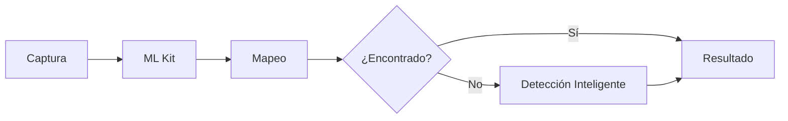

# Guía de Uso del Escáner Inteligente BioWay

## Tabla de Contenidos
1. [Para Usuarios](#para-usuarios)
2. [Para Desarrolladores](#para-desarrolladores)
3. [Preguntas Frecuentes](#preguntas-frecuentes)

---

## Para Usuarios

### 🎯 Cómo Usar el Escáner

#### Paso 1: Acceder al Escáner
1. Abre la aplicación BioWay
2. En el menú principal, toca el ícono de **cámara** o **"Escanear Material"**
3. Permite el acceso a la cámara cuando se solicite

#### Paso 2: Preparar el Material
Para obtener mejores resultados:
- ✅ **Buena iluminación** - Usa luz natural o artificial brillante
- ✅ **Fondo simple** - Coloca el objeto sobre una superficie lisa
- ✅ **Objeto centrado** - Mantén el material en el centro del marco
- ✅ **Distancia adecuada** - Ni muy cerca ni muy lejos (20-40 cm)

#### Paso 3: Escanear
1. **Apunta** la cámara al material reciclable
2. **Centra** el objeto en el marco verde
3. **Toca** el botón de captura (círculo grande)
4. **Espera** 1-2 segundos para el análisis

#### Paso 4: Ver Resultados
El sistema te mostrará:
- **Tipo de material** detectado
- **Nivel de confianza** (porcentaje)
- **Instrucciones de reciclaje**
- **Valor en puntos** por kilogramo

### 📊 Materiales Detectables

| Material | Ejemplos | Tips de Detección |
|----------|----------|-------------------|
| **Botellas PET** | Agua, refrescos | Vacías y sin etiqueta |
| **Cartón** | Cajas, empaques | Aplanado y seco |
| **Vidrio** | Botellas, frascos | Limpio y sin tapas |
| **Aluminio** | Latas de bebidas | Aplastadas |
| **Papel** | Hojas, periódicos | Sin grapas |
| **Bolsas plásticas** | Supermercado | Limpias y secas |
| **Orgánicos** | Restos de comida | Frescos |
| **Electrónicos** | Cables, dispositivos | Completos |
| **Textiles** | Ropa, telas | Limpios |

### 🔧 Solución de Problemas

| Problema | Solución |
|----------|----------|
| **"No se detecta nada"** | Mejora la iluminación y centra el objeto |
| **"Detección incorrecta"** | Limpia la cámara y usa fondo simple |
| **"Baja confianza"** | Acerca más el objeto, mejora el enfoque |
| **"Cámara no funciona"** | Verifica permisos en configuración del teléfono |

---

## Para Desarrolladores

### 🏗️ Arquitectura Técnica

#### Componentes Principales

```dart
// 1. Servicio de Detección (Singleton)
WasteDetectionService {
  - ImageLabeler (ML Kit)
  - Category Mapping
  - Intelligent Detection System
}

// 2. UI Scanner Screen
WasteScannerScreen {
  - Camera Controller
  - Result Display
  - Animations
}
```

### 🔌 Integración en tu Código

#### Uso Básico

```dart
import 'package:bioway/services/ai/waste_detection_service.dart';

// Inicializar servicio
final detector = WasteDetectionService();
await detector.initialize();

// Clasificar imagen
final result = await detector.classifyImage(imageFile);

// Procesar resultado
if (result.success) {
  print('Material: ${result.primaryClassification.category.name}');
  print('Confianza: ${result.primaryClassification.confidence}');
}
```

#### Agregar Nueva Categoría

1. **Actualizar mapeo en `waste_detection_service.dart`:**

```dart
// En mlKitMapping
'NuevaEtiqueta': 'nueva_categoria',

// En baseCategories
'nueva_categoria': WasteCategory(
  id: 'NEW',
  name: 'Nueva Categoría',
  code: 'NEW-01',
  color: 0xFF123456,
  recyclingInstructions: 'Instrucciones...',
  value: 10,
),
```

2. **Agregar palabras clave inteligentes:**

```dart
// En _intelligentCategoryDetection
'nueva_categoria': {
  'keywords': ['palabra1', 'palabra2'],
  'weight': 1.0,
},
```

### 📊 Métricas de Rendimiento

```dart
// Habilitar logs de debug
// Descomentar en waste_detection_service.dart:
print('🔍 Etiquetas detectadas por ML Kit:');
for (final label in labels) {
  print('  - ${label.label}: ${label.confidence}');
}
```

### 🔄 Flujo de Procesamiento



### 🛠️ Personalización Avanzada

#### Ajustar Umbrales

```dart
// En waste_detection_service.dart
static const double threshold = 0.3; // Más bajo = más detecciones
static const double highConfidenceThreshold = 0.6; // Alta confianza
```

#### Modificar Resolución de Cámara

```dart
// En waste_scanner_screen.dart
CameraController(
  camera,
  ResolutionPreset.high, // Opciones: low, medium, high, veryHigh, ultraHigh
  enableAudio: false,
);
```

---

## Preguntas Frecuentes

### General

**¿Funciona sin internet?**
> Sí, después de la descarga inicial de modelos, funciona completamente offline.

**¿Qué precisión tiene?**
> Entre 75-85% dependiendo de las condiciones de iluminación y calidad de imagen.

**¿Consume mucha batería?**
> El procesamiento es eficiente y optimizado para dispositivos móviles.

### Técnicas

**¿Puedo entrenar mi propio modelo?**
> Actualmente usa modelos pre-entrenados de Google. Modelos personalizados están en desarrollo.

**¿Soporta múltiples objetos?**
> Por ahora detecta un objeto a la vez. Multi-detección está planeada.

**¿Qué dispositivos son compatibles?**
> Android 5.0+ y iOS 11.0+ con al menos 2GB de RAM.

### Desarrollo

**¿Cómo agregar nuevos idiomas?**
> Los nombres y descripciones están en `baseCategories`. Puedes internacionalizarlos.

**¿Se puede usar con video en tiempo real?**
> Sí, el método `classifyCamera()` soporta procesamiento de frames en tiempo real.

**¿Dónde están los modelos?**
> Google ML Kit descarga y gestiona los modelos automáticamente.

---

## 📚 Recursos Adicionales

- [Documentación de Google ML Kit](https://developers.google.com/ml-kit)
- [Flutter Camera Plugin](https://pub.dev/packages/camera)
- [Arquitectura Completa](AI_SCANNER_ARCHITECTURE.md)

## 🆘 Soporte

Para problemas técnicos o sugerencias:
- Email: soporte@bioway.com.mx
- GitHub Issues: [github.com/bioway/app/issues](https://github.com/bioway/app/issues)

---

*Última actualización: Enero 2025*